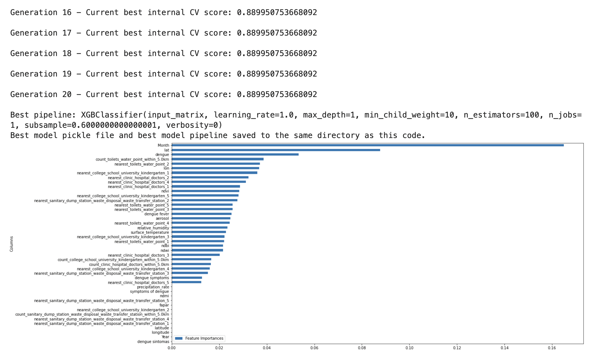
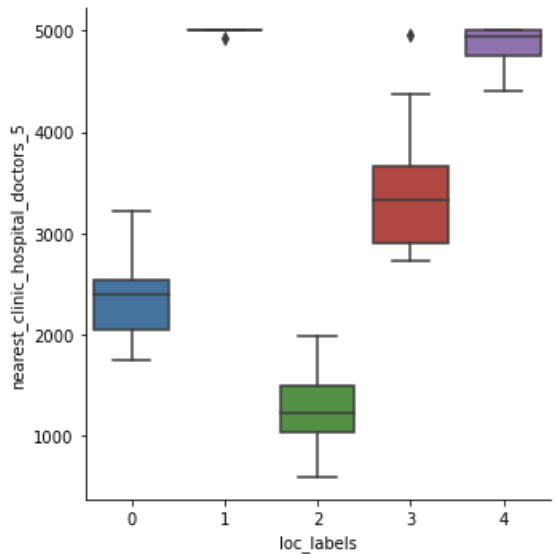

# AEDES

This repository contains codes that demonstrate the use of Project AEDES for data collection on remote sensing using LANDSAT, MODIS and SENTINEL. Full repository is linked [here](https://github.com/xmpuspus/aedes).

Author: Xavier Puspus  
Affiliation: [Cirrolytix Research Services](cirrolytix.com)

### Installation


Install using:

```console
foo@bar:~$ pip install aedes
```


# Satellite Data

Import the modules of the package using:

```
import aedes
from aedes.remote_sensing_utils import generate_random_ee_points, df_to_ee_points, get_satellite_measures_from_points
from aedes.remote_sensing_utils import visualize_on_map

from aedes.osm_utils import reverse_geocode_points

from aedes.automl_utils import perform_clustering, perform_classification
```

### Authentication and Initialization
This packages uses Google Earth Engine (sign-up for access [here](https://earthengine.google.com/signup/)) to query remote sensing data. To authenticate, simply use:

```
aedes.remote_sensing_utils.authenticate()
```

This script will open a google authenticator that uses your email (provided you've signed up earlier) to authenticate your script to query remote sensing data. After authentication, initialize access using:

```
aedes.remote_sensing_utils.initialize()
```

### Area of Interest

First, find the bounding box geojson of an Area of Interest (AOI) of your choice using this [link](https://boundingbox.klokantech.com/).


### Get Normalized Difference Indices and Weather Data

Use the one-liner code `get_satellite_measures_from_points` to extract NDVI, NDWI, NDBI, Aerosol Index (Air Quality), Surface Temperature, Precipitation Rate and Relative Humidity for your preset number of points of interest `sample_points` within a specified date duration `date_from` to `date_to`.

```
%%time
QC_AOI = [[[120.98976275,14.58936896],
           [121.13383232,14.58936896],
           [121.13383232,14.77641364],
           [120.98976275,14.77641364],
           [120.98976275,14.58936896]]] # Quezon city
           
# Get random points sampled from the AOI if you don't have ground truth data points yet.
# You can also generate your own Earth Engine Points from your own long-lat pairs using generate_random_ee_points()
points = generate_random_ee_points(QC_AOI, sample_points=50)

# Get satellite features on each point
qc_df = get_satellite_measures_from_points(points, QC_AOI, 
                                              date_from='2017-07-01', 
                                              date_to='2017-09-30')
```

### Reverse Geocoding

This package also provides an easy-to-use one-liner reverse geocoder that uses [Nominatim](https://nominatim.org/)

```
%%time
rev_geocode_qc_df = reverse_geocode_points(qc_df)
rev_geocode_qc_df.head()
```

### Geospatial Clustering

This packages uses KMeans as the unsupervised learning technique of choice to perform clustering on the geospatial data enriched with normalized indices, air quality and surface temperatures with your chosen number of clusters.

```
clustering_model = perform_clustering(rev_geocode_qc_df, n_clusters=3)
rev_geocode_qc_df['labels'] = pd.Series(clustering_model.labels_)
```

### Visualize Hotspots on a Map

This packages also provides the capability of visualizing all the points of interest with their proper labels using one line of code.

```
vizo = visualize_on_map(rev_geocode_qc_df)
vizo
```


# OpenStreetMap Data


The package needed is imported as follows:

```
from aedes.osm_utils import initialize_OSM_network, get_OSM_network_data 
```

### Spatial Data from Map Networks

In order to initialize and create an OpenStreetMap (OSM) network from a geojson of an AOI, use:


```
%%time
network = initialize_OSM_network(aoi_geojson)
```


### Query Amenities Data 

In order to pull data for, say, healthcare facilities (more documentation on amenities [here](https://wiki.openstreetmap.org/wiki/Map_features#Amenity)), use this one-liner:

```
final_df, amenities_df, count_distance_df = get_OSM_network_data(network,
                     satellite_df,
                     aoi_geojson,
                    ['clinic', 'hospital', 'doctors'],
                    5,
                    5000,
                    show_viz=True)
```


This function pulls the count and distance of each node from a possible healthcare facility (for this example). It also outputs the original dataframe concatenated with the count and distances. The actual amenities data is also returned. We can then pass the resulting `final_df` dataframe into another clustering algorithm to produce dengue risk clusters with the added health capacity features.


# Social Listening Data

To query for Google search trends, import:

```
from aedes.social_listening_utils import get_search_trends
```

then use:

```
iso_geotag = "PH-00"
search_df = get_search_trends(iso_geotag)
```

This pulls data for the top 5 dengue-related searches within a geolocation dictated by an ISO tag listed and described [here](https://en.wikipedia.org/wiki/ISO_3166-2:PH). Below is a sample:

| date                |   dengue |   dengue symptoms |   dengue fever |   symptoms of dengue |   dengue sintomas | isPartial   |
|:--------------------|---------:|------------------:|---------------:|---------------------:|------------------:|:------------|
| 2021-09-12 00:00:00 |       17 |                 2 |              3 |                    0 |                 1 | False       |
| 2021-09-19 00:00:00 |       12 |                 3 |              1 |                    1 |                 1 | False       |
| 2021-09-26 00:00:00 |        6 |                 1 |              0 |                    0 |                 1 | False       |
| 2021-10-03 00:00:00 |        5 |                 1 |              0 |                    0 |                 0 | False       |
| 2021-10-10 00:00:00 |        9 |                 1 |              0 |                    0 |                 0 | False       |
| 2021-10-17 00:00:00 |        9 |                 1 |              0 |                    0 |                 0 | False       |
| 2021-10-24 00:00:00 |        9 |                 1 |              0 |                    0 |                 0 | False       |
| 2021-10-31 00:00:00 |        5 |                 1 |              1 |                    0 |                 0 | False       |


# AEDES Demo Web Application

In order to demonstrate the functionalities of using the AEDES python package, we can use Streamlit to display a web application that takes in a geojson and outputs the hotspots and the recommended cities at risk. Clone this repository, `cd` into it and follow the instructions below.

### Streamlit Setup

Install streamlit using:

```console
foo@bar:~$ pip install streamlit
```

Run `streamlit hello` to see if the installation was successful.

### Running the sample web application 

Simply run the code below to run a local version of your web application that outputs the at-risk areas as hotspots on a map as well as a subsequent list of places to prioritize disease-related proactive measures.  

The one below is for a dengue hotspot map for Quezon City, Philippines.


This other screenshot shows the web application demonstrating the use of the geospatial modelling in outputting locations of high-risk areas.


Another example for Cotabato City, Philippines is shown below.


# AEDES Automated Machine Learning

We have also added functionality to this package that performs tree-based pipeline optimization (TPOT) that optimizes machine learning pipelines using genetic algorithm as described [here](https://epistasislab.github.io/tpot/).

Data preparation is still required as we as train-test splitting as needed. Using the one-liner `perform_classification` or `perform_regression`, we can train a machine learning model hundreds to thousands of times in different configurations, feature engineering methodologies and various models in order to output:

- the best ml model (in-memory and saved as a pickle file, default is `best_model.pkl`)
- the best ml pipeline which is a python script that describes the ml methodology
- and the feature importances (both as a dataframe, and as a plot)

```
model, feature_imps_df = perform_classification(X_train, y_train)
```

The output should look like this:


which also generates a python script of the best machine learning model pipeline similar to this [script](https://github.com/xmpuspus/aedes/blob/main/best_aedes_model.py).

# INFORM Risk Models


We can use `perform_clustering()` to automatically create 5 clusters from the input data, with features preselected based on the INFORM risk framework. The packages needed are:

```
from aedes.automl_utils import perform_clustering
import pandas as pd
```

To demonstrate one example, say for *Lack of Coping Capacity*, the features needed are `['longitude',
 'latitude',
 'nearest_clinic_hospital_doctors_1',
 'nearest_clinic_hospital_doctors_2',
 'nearest_clinic_hospital_doctors_3',
 'nearest_clinic_hospital_doctors_4',
 'nearest_clinic_hospital_doctors_5',
 'count_clinic_hospital_doctors_within_5.0km']`. As long as the input data contains the same columns, we can just perform clustering as follows:
 
```
df = pd.read_csv("flatfile_of_your_dataset.csv")

loc_features = ['longitude',
 'latitude',
 'nearest_clinic_hospital_doctors_1',
 'nearest_clinic_hospital_doctors_2',
 'nearest_clinic_hospital_doctors_3',
 'nearest_clinic_hospital_doctors_4',
 'nearest_clinic_hospital_doctors_5',
 'count_clinic_hospital_doctors_within_5.0km']
 
 # Perform clustering (this model can be saved and re-loaded later using joblib)
loc_model = perform_clustering(df, 
                               features=loc_features,
                               n_clusters=5)
# Create the labels                               
loc_labels = pd.Series(loc_model.labels_)

# Create INFORM risk dataframe for Lack of Coping Capacity
loc_full_df = df[loc_features].drop_duplicates()
loc_full_df['loc_labels'] = loc_labels
```

We then perform analysis on categorical comparison of feature distribution as demonstrated by the sample images below:

Nearest Clinics/Hospitals  |  Count of Clinics/Hospitals
:-------------------------:|:-------------------------:
  |  

We see from above that, in decreasing count of and increasing distance from coping facilities, the cluster labels are: `[2, 0, 3, 4, 1]`. We can then create the *Lack of Coping Capacity* risk labels by re-labelling the clusters in this order and visualize the risk map as follows (darker is riskier):

```
from aedes.remote_sensing_utils import visualize_on_map

clusters_to_loc_risk_df = pd.DataFrame({"labels":list(range(1, 6)),
                                        "loc_labels":[2, 0, 3, 4, 1]})

points_df = loc_full_df.merge(clusters_to_loc_risk_df)

visualize_on_map(points_df)
```


We can also save and load the clustering model as follows:

```
import joblib

# Save the clustering model as a pickle file
joblib.dump(loc_model, "loc_clustering_model.pkl")

# Load the clustering model from a pickle file
loc_model = joblib.load("loc_clustering_model.pkl")
```
